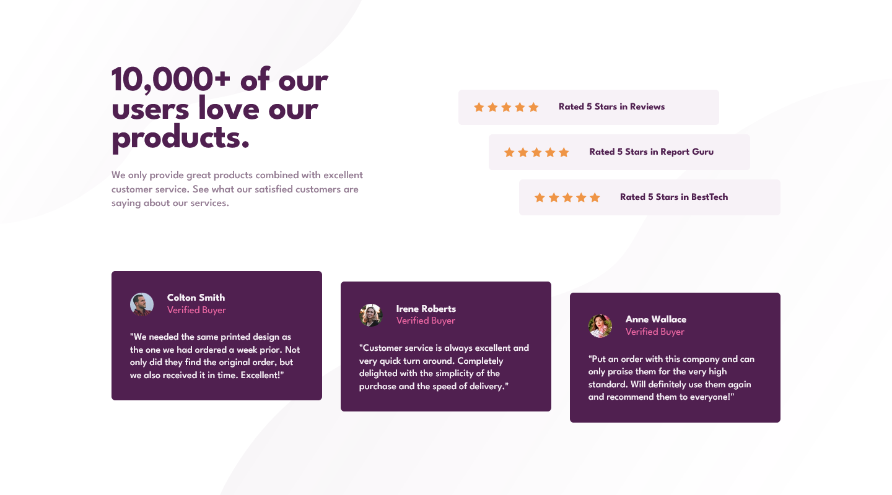
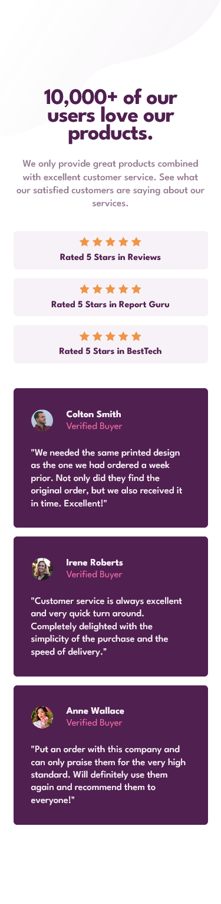

# Frontend Mentor - Social proof section solution

This is a solution to the [Social proof section challenge on Frontend Mentor](https://www.frontendmentor.io/challenges/social-proof-section-6e0qTv_bA). Frontend Mentor challenges help you improve your coding skills by building realistic projects.

## Table of contents

- [Overview](#overview)
  - [The challenge](#the-challenge)
  - [Screenshot](#screenshot)
  - [Links](#links)
- [My process](#my-process)
  - [Analysis](#analysis)
  - [Built with](#built-with)
  - [Continued development](#continued-development)
- [Author](#author)

## Overview

### The challenge

Users should be able to:

- View the optimal layout for the section depending on their device's screen size

### Screenshot

### Links

- Solution URL: [Project on GitHub](https://github.com/joanFaseDev/social-proof-section)
- Live Site URL: [Project hosted through Vercel](https://social-proof-section-five-roan.vercel.app/)

## My process

### Analysis

- Project is about building a responsive web page made out of two designs, mobile and desktop.
- The page displayed two different kind of cards, each in three units. That means we can reuse a lot of code just by using efficient naming convention and simple analysis.

- The first type of card is made of five icons that can be grouped in a _div_ element plus a heading which means we can use a _section_ as a container since _article_ doesn't really fit the situation (these cards are not standalone content). All the cards will be nested in a _div_ container mainly because it will be easier to handle when doing the desktop design.

- The seconde type of card is a basic profil card with a name, photo, status and comment. Basically we can use a _section_ as a container, a _h2_ for the title and a pair of _p_ for status/comment. Between the _section_ and the content, we'll add an other _div_ for the layout.
  Again, all the cards will be nested nested in _div_ so that it can be used when doing desktop design.

- Apart from the two types of card, there's also a main title and a paragraph. That will be our _h1_ and _p_,nested in a _div_.

- We'll use a _main_ element as a container for the whole then change the _body_ into a flexbox for the alignement.
- We'll start with the mobile design first because it's easier to lay out. There's less complexity and it's basically the standard way nowadays (from what i read and saw).
- For the desktop design, we'll use _media queries_ plus simple _CSS Grid_ and _FlexBox_. The 'star' cards will each have a different horizontal alignment (_flex-start_, _center_, _flex-end_) and the 'profil' cards a different vertical alignment.

- There's also two different background images to include for each design, mobile and desktop. We'll dealt with it at the end because of personnal preferences (i always find it easier that way).

### Built with

- Semantic HTML5 markup
- CSS custom properties
- Flexbox
- CSS Grid
- Mobile-first workflow

### Continued development

- I need to work on an efficient way to build upon my mobile design to create my desktop design. Currently, the way i work is too messy because, to create the desktop design, i often end up removing code i did on the mobile part. Which is bad, the mobile design should serve as a foundation of sort to simplify the building of the desktop design, not the opposite way.

I don't like the way i handled that project but i think the very realisation that something is wrong is in fact a good thing. All i need to do now is work on it.

## Author

- Frontend Mentor - [@joanFaseDev](https://www.frontendmentor.io/profile/joanFaseDev)
